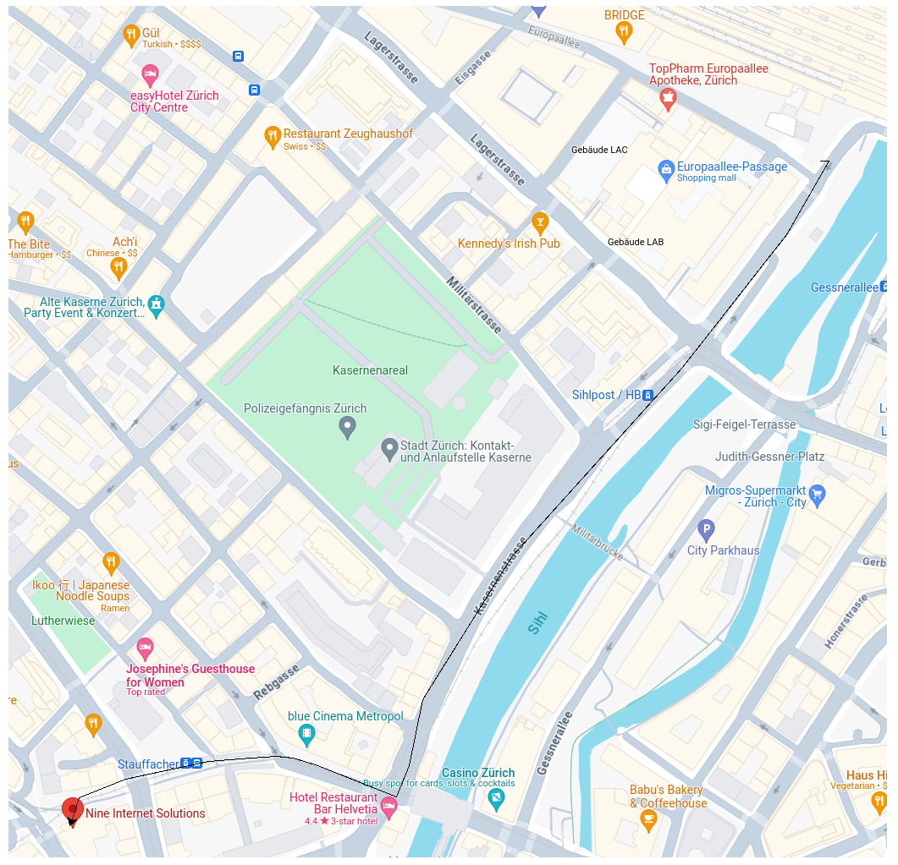

# MarvinSimmen-Workshop
## Tag 1:

Datei erstellt
Befehle kennengelernt: add, commit, status...
Kürzel auf der Tastatur gelernt: ctrl+x oder y/n oder ctrl+s
Mit RaspberryPi verbunden
Nginx updated + installiert
Eigenen Webserver erstellt mit den default settings
Setting up server blocks
Probleme finden mit -t, Befehl
Container vs. virtuelle Maschinen
Container sind Softwarepakete, die alle Elemente enthalten, die zur Ausführung in beliebigen Umgebungen erforderlich sind.
Physische Hardware-> Host-Betriebssystem->Hypervisor->Gast-system(Virtuelle MAschine)
(Kleinste Rechtschreibfehler oder mangelnde/überflüssige Abstände können zum Fehler des ganzes Organismus führen)
Begriffe wie Image oder Nextcloud kennengelerntg.
Docker installiert und gestartet
(Englisch ist ein Must beim programmieren)

## Tag 2:

Lösung für Bash Task: APTENODYTES PATACONICUS
Zahlreiche neue Funktionen von Terminal zusammen mit Bash kennengelernt.
Speziell im Zusammenhang mit Files. Z.B. wie man Zips öffnet, oder bearbeitet oder überhaupt zum Bearbeiten zur Verfügung stellt.
Am Nachmittag gingen wir dann in das Lager und den Raum mit den wichtigen Servern. Die Sicherheitsmassnahmen dort sind extrem streng.
Für das Betreten der Räume braucht es einen registrierten Fingerabdruck und überall sind Kameras verteilt, die das Gelände rum um die Uhr überwachen.
Alle Ressourcen, die für die wichtigen Daten der Kunden benötigt werden, sind doppelt vorhanden: Server, Strom, Lankabel.
Nach etwa 10 Jahren müssen die Geräte ausgewechselt werden. Dabei muss man im vorhinein die betroffenen Personen informieren und bei Ausbau extrem vorsichtig und genau sein.
Ich habe herausgefunden, dass ich in Sachen Informatik mich neben der Software vor allem für das Materielle, die Hardware, interessiere.
Bei der Arbeit muss man stets Ordnung und den Fokus bewahren, weil der kleinste Fehler mühsame Folgen haben kann.
Darum wird die Arbeit stets parallel dokumentiert.
Dies hat den Vorteil, dass man am nächsten Tag noch weiss, was man alles gemacht hat, oder wenn jemand anderes daran weiterarbeitet, kann er schnell auf den aktuellen Stand gebracht werden.
Am Morgen gibt es jeweils Meetings mit den Arbeitspartnern, in denen der aktuelle Stand vermittelt wird und bei allfälligen Problemen gemeinsam nach Lösungen gesucht.

## Tag 3:

Kleine Einführung in die Programmiersprache Ruby. Konzept ist bei allen Programmiersprachen ähnlich (Ein Rezept, dass ein Resultat hervorbringt)
Die Sprachen (Befehle usw.) unterscheiden sich dafür grundlegend. Wenn man aber eine Programmiersprache kann, dann kann man auch alle anderen besser nachvollziehen.
Je nach Anwendung des Programmierens, eignen sich gewisse Sprachen unterschiedlich gut.
Ruby ist z.B. sehr gut geeignet für Webpublikationsentwicklung und ist sehr objektorientiert.
Als zweites haben wir uns die Sprache Python angeschaut. Mit der haben wir durch eine Karte mit ein paar einfachen Befehlen einen Pfeil auf einer Karte zum Ziel geführt.

Python ist eine sehr umfangreiche und sehr beliebte Programmiersprache.

